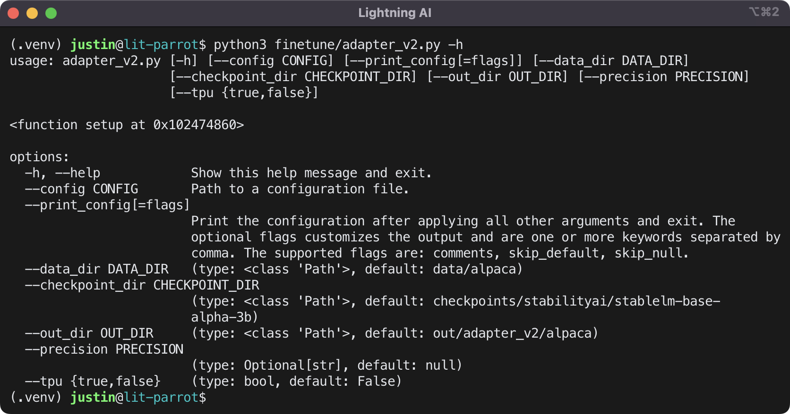

# Lightning FPT (Finetuning Pre-Trained Transformers)

Lightning FPT is focused on [Lightning AI's](https://lightning.ai) LLM implementations shown below:

- [Lit-Parrot](https://github.com/Lightning-AI/lit-parrot)
- [Lit-LLaMA](https://github.com/Lightning-AI/lit-llama)

## Frameworks, Weights, Data, and Evaluation Harness

Listed below are the frameworks, weights, and datasets used by this repo.

### Frameworks

- [PyTorch](https://pytorch.org/docs/stable/index.html)
- [Lightning Fabric](https://lightning.ai/docs/fabric/stable/)
- [SheepRL](https://github.com/Eclectic-Sheep/sheeprl) (for RLHF)

> **Note**
>
> RLHF is a WIP in SheepRL

### Pretrained weights

- [Falcon](https://huggingface.co/tiiuae/falcon-40b)
- [OpenLLaMA](https://github.com/openlm-research/open_llama)

### Instruction Tuning Dataset

- [Stanford Alpaca](https://github.com/tatsu-lab/stanford_alpaca)

### Parameter Efficient Finetuning

- [LLaMA-Adapter](https://github.com/OpenGVLab/LLaMA-Adapter)
- [LoRA](https://github.com/microsoft/LoRA)

### Evaluation Harnesses:

- Eleuther AI's [lm-evaluation-harness](https://github.com/EleutherAI/lm-evaluation-harness)

## Setup

First, [fork this repo](https://docs.github.com/en/get-started/quickstart/fork-a-repo#forking-a-repository), then [clone this repo](https://docs.github.com/en/repositories/creating-and-managing-repositories/cloning-a-repository#cloning-a-repository) with the following command:

> **Note**
>
> the following assumes you have a directory named `Developer`

```sh
cd Developer
git clone https://github.com/{{YOUR GITHUB USERNAME}}/lightning-fpt.git
```

Then navigate to the clone and create a directory named `sub` and navigate to that new directory with:

```sh
cd lightning-fpt
mkdir sub
cd sub
```

then clone Lit-LLaMA, Lit-Parrot, SheepRL, and lm-evaluation-harness with:

```sh
git clone https://github.com/Lightning-AI/lit-llama.git
git clone https://github.com/Lightning-AI/lit-parrot.git
git clone https://github.com/Eclectic-Sheep/sheeprl.git
git clone https://github.com/EleutherAI/lm-evaluation-harness.git
```

then, navigate back to the project root with:

```sh
cd ..
```

Next, create virtual environments for each tool.

1. install an editable version of lightning_fpt with dev extras

   ```sh
   python3 -m venv .venv
   source .venv/bin/activate
   pip install -e ".[dev]"
   deactivate
   ```

2. setup lit-parrot:

   ```sh
   cd sub/lit-parrot
   python3 -m venv .venv
   source .venv/bin/activate
   # if on CUDA, do
   pip install --index-url https://download.pytorch.org/whl/nightly/cu118 --pre 'torch>=2.1.0dev'
   # else, if on CPU (including macOS)
   pip install --index-url https://download.pytorch.org/whl/nightly/cpu --pre 'torch>=2.1.0dev'
   # complete the install if on CUDA or mac
   pip install -r requirements.txt
   deactivate
   ```

3. setup lit-llama:

   ```sh
   cd ../lit-llama
   python3 -m venv .venv
   source .venv/bin/activate
   pip install -r requirements.txt
   deactivate
   ```

4. setup SheepRL:

   > **Note**
   >
   > SheepRL requires a Python version less than 3.11 and greater than or equal to 3.8.

   If you have Python 3.10, 3.9, or 3.8 as system Python, you can create and activate a virtual environment with:

   ```sh
   cd ../sheeprl
   python3 -m venv .venv
   source .venv/bin/activate
   ```

   If you have Python 3.11 or later as system Python, but have [conda](https://docs.conda.io/en/latest/) or [miniconda](https://docs.conda.io/en/latest/miniconda.html) installed, create the conda env with:

   ```sh
   conda create -n srl python=3.10 -y
   conda activate srl
   ```

   Regardless of whether you used venv or conda to create a virtual environment, you can use pip to install the requirements with the following steps.

   ```sh
   pip install .
   # call the Click CLI without any args
   sheeprl
   # deactivate the env
   deactivate
   ```

   > **Note**
   >
   > if you are on an M-series mac and encounter an error attributed box2dpy during install, you need to install SWIG using the instructions shown below.

   It is recommended to use [homebrew](https://brew.sh/) to install [SWIG](https://formulae.brew.sh/formula/swig) to support [Gym](https://github.com/openai/gym).

   ```sh
   # if needed, install homebrew
   /bin/bash -c "$(curl -fsSL https://raw.githubusercontent.com/Homebrew/install/HEAD/install.sh)"
   # then, do
   brew install swig
   # then attempt to pip install again
   pip install .
   ```

5. Install lm-evaluation-harness

   ```sh
   cd ../lm-evaluation-harness
   python3 -m venv .venv
   source .venv/bin/activate
   # install with gptq extra to support lit-parrot triton kernels
   pip install ".[gptq]"
   deactivate
   ```

6. Download and convert Falcon Weights

   ```sh
   # navigate to lit-parrot
   cd ../lit-parrot
   source .venv/bin/activate
   # download
   python3 scripts/download.py --repo_id tiiuae/falcon-7b
   # convert
   python3 scripts/convert_hf_checkpoint.py --checkpoint_dir checkpoints/tiiuae/falcon-7b
   ```

7. Prepare the Alpaca dataset

   ```sh
   # remain in lit-parrot
   python3 scripts/prepare_alpaca.py \
        --destination_path data/alpaca \
        --checkpoint_dir checkpoints/tiiuae/falcon-7b
   ```

8. Finetune

   > **Note**
   >
   > if on a mac, be sure to set the MPS fallback

   > **Note**
   >
   > as of June 2023, the command shown for mac is not working on an M2 Pro with
   > 10‑core CPU, 16‑core GPU, 16‑core Neural Engine and 32gb UM

   > **Warning**
   > 
   > IF ON A MAC WITH THE ABOVE SPECS OR LESS, DO NOT ATTEMPT TO RUN MORE THAN ONE FINETUNING SESSION AT A TIME

   ```sh
   # if on a mac, set the mps fallback
   export PYTORCH_ENABLE_MPS_FALLBACK=1
   # finetune
   # if on CUDA, do
   python3 finetune/adapter_v2.py \
        --data_dir data/alpaca  \
        --checkpoint_dir checkpoints/tiiuae/falcon-7b \
        --out_dir out/adapter/alpaca
   # if on mac, do
   python3 finetune/adapter_v2.py \
        --data_dir data/alpaca  \
        --checkpoint_dir checkpoints/tiiuae/falcon-7b \
        --out_dir out/adapter/alpaca
        --precision 32-true
   ```

   Available finetuning arguments

   

## Tutorials and References

- [Understanding Large Language Models](https://magazine.sebastianraschka.com/p/understanding-large-language-models)
- [Understanding Encoder And Decoder LLMs](https://magazine.sebastianraschka.com/p/understanding-encoder-and-decoder)
- [Finetuning Falcon LLMs More Efficiently With LoRA and Adapters](https://lightning.ai/pages/community/finetuning-falcon-efficiently/)
- [Understanding Parameter-Efficient Finetuning](https://lightning.ai/pages/community/article/understanding-llama-adapters/)
- [Parameter-Efficient LLM Finetuning With LoRA](https://lightning.ai/pages/community/tutorial/lora-llm/)
- [Accelerating Large Language Models with Mixed-Precision Techniques](https://lightning.ai/pages/community/tutorial/accelerating-large-language-models-with-mixed-precision-techniques/)
- [Falcon – A guide to Finetuning and Inference](https://lightning.ai/pages/blog/falcon-a-guide-to-finetune-and-inference/)
- [GPTQ: Accurate Post-Training Quantization for Generative Pre-trained Transformers](https://arxiv.org/abs/2210.17323)
